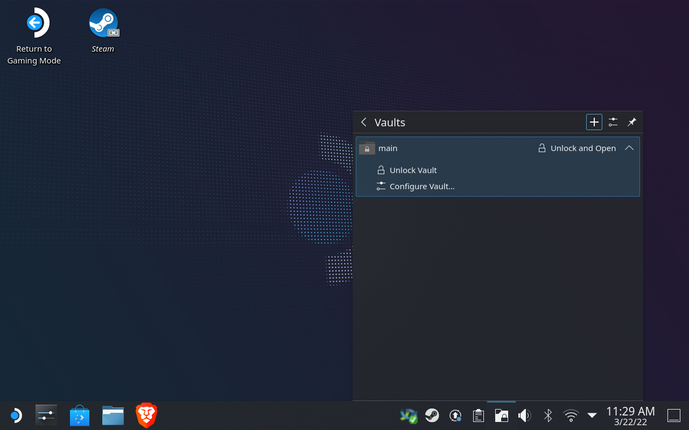
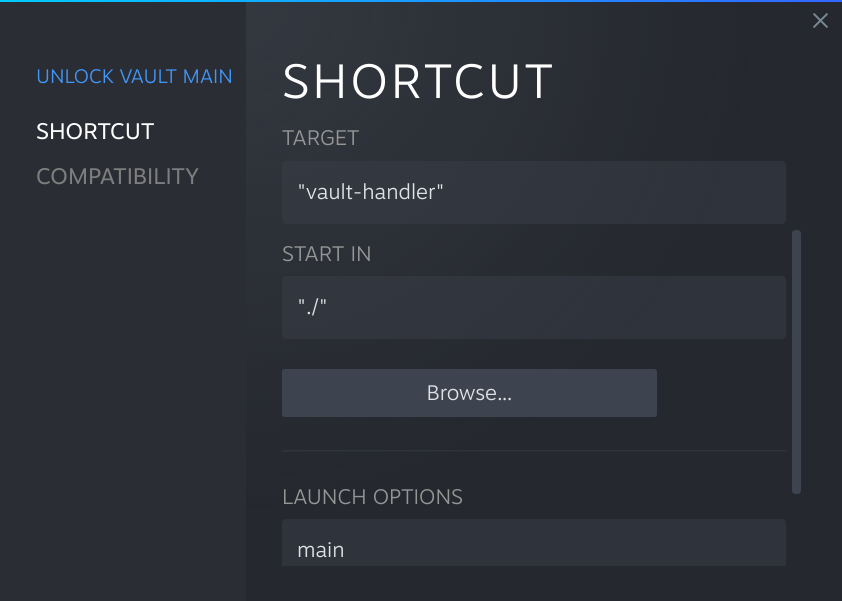

# Steam Deck Tips and Tricks!

I'm compiling here Steam Deck quality of life improvements and tricks that will make working with it smoother and a more comfy place to work in.

## Contents

- [Easy SSH access to the Steam Deck](#easy-ssh-access-to-the-steam-deck)
  - [On the Steam Deck](#on-the-steam-deck)
  - [On your computer](#on-your-computer)
- [Disable powersave on wlan0 for snappier remote command](#disable-powersave-on-wlan0-for-snappier-remote-command)
- [Add konsole (terminal) to Steam Deck UI](#add-konsole-terminal-to-steam-deck-ui)
- [Encrypted Vaults with Plasma Vault and gocryptfs](#encrypted-vaults-with-plasma-vault-and-gocryptfs)
  - [Browser profile or any config folder inside an encrypted Vault](#browser-profile-or-any-config-folder-inside-an-encrypted-vault)
  - [Unlock Plasma Vaults from the Steam Deck UI](#unlock-plasma-vaults-from-the-steam-deck-ui)
- [Shared keyboard, mouse and clipboard with barrier](#shared-keyboard-mouse-and-clipboard-with-barrier)
  - [On the main computer](#on-the-main-computer)
  - [On the Steam Deck](#on-the-steam-deck)
- [auto-cpufreq](#auto-cpufreq)
  - [Low performance in games on battery](#low-performance-in-games-on-battery)
- [Wireguard](#wireguard)

---

## Easy SSH access to the Steam Deck

### On the Steam Deck

In desktop mode, set a password for your user

```sh
passwd
```

Enable and start the ssh server

```sh
sudo systemctl enable --now sshd.service
```

Remember the ip address of the Steam Deck
```sh
ip addr
```

### On your computer

Generate a new keypair
```sh
ssh-keygen -t ed25519 -f ~/.ssh/steamdeck_ed25519
```
(replace `<ip>` with the ip of the Steam Deck)

Copy the public key over to the Steam Deck (will ask for the password of user deck)
```sh
ssh-copy-id -i ~/.ssh/steamdeck_ed25519.pub deck@<ip>
```

Create a configuration for the Steam Deck, create `~/.ssh/config` and add:
```
Host steamdeck
  HostName <ip>
  IdentityFile ~/.ssh/steamdeck_ed25519
  User deck
```

Now you can simply connect with
```sh
ssh steamdeck
```

On the Steam Deck you can disable password authentication:

Open `/etc/ssh/sshd_config` and find:
```
#PasswordAuthentication yes
```
and change to
```
PasswordAuthentication no
```
Reload sshd
```sh
sudo systemctl reload sshd.service
```

## Disable powersave on wlan0 for snappier remote command

If ssh or barrier is lagging

```sh
sudo iw dev wlan0 set power_save off
```

## Add konsole (terminal) to Steam Deck UI

It can be practical to have konsole directly accessible from the Steam Deck UI

Add non-steam game to Steam in Desktop mode, select konsole and add as launch options:

```
--fullscreen --notransparency
```


This should make it work correctly inside gamescope.
For the controller layout make sure to select the **Web Browser** Template.

## Encrypted Vaults with Plasma Vault and gocryptfs

Plasma Vault is a handy way to quickly create and manage encrypted folder embedded into the desktop environment.

Vaults might be hidden by default under Status and notifications visible by clicking the up arrow left to the date and time.

You can choose between **CryFS**, **EncFS** and **gocryptfs** crypto backend. My preferred is gocryptfs: https://wiki.archlinux.org/title/Gocryptfs

To add gocryptfs support:

```sh
sudo pacman --cachedir /tmp -Sw --noconfirm gocryptfs
mkdir -p ~/.local/bin
tar -xf /tmp/gocryptfs-*.pkg.tar.zst -C ~/.local/bin --strip-components=2 usr/bin
sudo rm -f /tmp/gocryptfs*.pkg.*
mkdir -p ~/.config/environment.d
echo 'PATH="$PATH:$HOME/.local/bin"' >> ~/.config/environment.d/envvars.conf
echo 'export PATH="$PATH:$HOME/.local/bin"' >> ~/.bash_profile
```

Logout and back in for Plasma Vaults to pick up gocryptfs.
You can now create encrypted Vaults with the gocryptfs backend.



### Browser profile or any config folder inside an encrypted Vault

It is more secure to store the browser profile in an encrypted Vault in case of theft or unauthorised access to the Steam Deck.

*The following uses brave as example but you can apply it to any app where you can identify the config path and move it into the encrypted vault.*

* We assume we have a plasma Vault called `main` located and unlocked at `~/Vaults/main`
* The flatpak version of Brave stores the user profile at `~/.var/app/com.brave.Browser/config/BraveSoftware`

- Close Brave if it's running
- Unlock the Vault
- Copy the user profile to the Vault
  + `cp -a ~/.var/app/com.brave.Browser/config/BraveSoftware ~/Vaults/main/`
- Remove the unencrypted profile and create a symlink to the encrypted profile
  + `rm -rf ~/.var/app/com.brave.Browser/config/BraveSoftware`
  + `ln -s ../../../../Vaults/main/BraveSoftware ~/.var/app/com.brave.Browser/config/BraveSoftware`
- Add the new location as allowed path to Brave flatpak using flatseal
  + Install **flatseal** from Discover and open it
  + Select **Brave Browser (com.brave.Browser)**
  + Under Filesystem > Other files add `~/Vaults/main/BraveSoftware`
- Now all user data will be stored encrypted and Brave will only launch if the Vault is unlocked!

Another popular example is Discord:
- The user profile is located at `~/.var/app/com.discordapp.Discord/config/discord`
- `cp -a ~/.var/app/com.discordapp.Discord/config/discord ~/Vaults/main/`
- `rm -rf ~/.var/app/com.discordapp.Discord/config/discord`
- `ln -s ../../../../Vaults/main/discord ~/.var/app/com.discordapp.Discord/config/discord`
- in **flatseal** add `~/Vaults/main/discord` under Filesystem > Other files

### Unlock Plasma Vaults from the Steam Deck UI

If you store your sensitive data and profiles inside Plasma Vaults, it might be practical to have a way to unlock them from the Steam Deck UI.

* Create `~/.config/systemd/user/plasma-vault@.service`:<br>
<sub>(`mkdir -p ~/.config/systemd/user ; vim ~/.config/systemd/user/plasma-vault@.service`)</sub>

```ini
[Unit]
Description=Mount plasma Vault %I
DefaultDependencies=no
Conflicts=umount.target
Before=umount.target

[Service]
Type=forking
ExecStartPre=-rm -f /tmp/plasma-vault-pass-%i
ExecStartPre=mkfifo /tmp/plasma-vault-pass-%i
ExecStart="%h/.local/bin/gocryptfs" -idle 5m --extpass "head -n 1 /tmp/plasma-vault-pass-%i" "%h/.local/share/plasma-vault/%I.enc" "%h/Vaults/%I"
ExecStartPost=-rm -f /tmp/plasma-vault-pass-%i
```
The systemd user service will handle the mounting of the encrypted folder in the user sessions.

You can set the idle time to lock to whatever you prefer.

Reload the systemd user daemon:
```sh
systemctl --user daemon-reload
```

* Create `~/.local/bin/vault-handler`:<br>
<sub>(`mkdir -p ~/.local/bin ; vim ~/.local/bin/vault-handler`)</sub>

```sh
#!/bin/sh
VAULT_NAME="$1"
VAULT_NAME_ESC="$(systemd-escape "$VAULT_NAME")"
mountpoint -q "$HOME/Vaults/$VAULT_NAME" && exit 0
PASS_FIFO="/tmp/plasma-vault-pass-${VAULT_NAME_ESC}"
for _ in $(seq 3)
do
        systemctl --user --no-block start plasma-vault@"$VAULT_NAME_ESC"
        sleep 1
        ksshaskpass "Unlock plasma Vault '$VAULT_NAME'" > "$PASS_FIFO" || exit 0
        sleep 1
        systemctl --user --quiet is-active plasma-vault@"$VAULT_NAME_ESC" && break
done
```
Make it executable:
```sh
chmod +x ~/.local/bin/vault-handler
```
This will use `ksshaskpass` as graphical password prompt to unlock the vault.

* Add `vault-handler` to Steam as Non-Steam game and in the launch options set the name of your vault to unlock (e.g.: `main`)




## Shared keyboard, mouse and clipboard with barrier

[barrier](https://wiki.archlinux.org/title/Barrier) is a fork of synergy which makes it possible to share keyboard, mouse and clipboard of one computer with another over the network.

Install barrier from Discovery on the computer and the Steam Deck.

### On the main computer
- Choose Server
- Configure Server... gives you a visual representation of relative position the computers should have
- Double click on the position relative to the main computer you want to position your Steam Deck
- As Screen name set `steamdeck` or the hostname you have set for your Steam Deck
- Start server
- Make sure port **24800** tcp is open if a firewall is configured


### On the Steam Deck
- Choose Client
- Auto config should work otherwise input the ip address of the main computer
- Make the client hide on startup: Barrier > Change Settings > Hide on startup
- Set barrier to autostart when Desktop mode is active:
  + System Settings > Startup and Shutdown > Autostart > + Add > + Add Application... > Utilities > Barrier


You should be good to go!

## auto-cpufreq

Automatically optimize cpu speed and power with auto-cpufreq: https://github.com/AdnanHodzic/auto-cpufreq

It remains to be seen if it really helps or does something on the Steam Deck.

The following steps will install auto-cpufreq into the home directory.

<sub>(Build steps taken from the AUR PKGBUILD: https://aur.archlinux.org/cgit/aur.git/tree/PKGBUILD?h=auto-cpufreq)</sub>

```sh
curl https://github.com/AdnanHodzic/auto-cpufreq/archive/refs/tags/v1.9.3.tar.gz | tar -xzf -
cd auto-cpufreq-*
mkdir -p "$HOME/.local"
ln -s . "$HOME/.local/usr"
python -m ensurepip --upgrade
python -m pip install --upgrade pip
python -m pip install distro
sed -i 's|^\([^#].*\)/usr/\(local/\)\?|\1'"$HOME"'/.local/|g' auto_cpufreq/core.py
python setup.py build
python setup.py install --root="$HOME/.local" --optimize=1 --skip-build
install -Dm755 scripts/cpufreqctl.sh -t "$HOME/.local/share/auto-cpufreq/scripts"
```

Add `export PATH="$PATH:$HOME/.local/bin"` to your `~/.bash_profile`.

Create a systemd user service that will activate auto-cpufreq: `~/.config/systemd/user/auto-cpufreq.service`

<sub>(`mkdir -p ~/.config/systemd/user ; vim ~/.config/systemd/user/auto-cpufreq.service`)</sub>
```ini
[Unit]
Description=auto-cpufreq - Automatic CPU speed & power optimizer for Linux

[Service]
Type=simple
ExecStart=sudo -E -n -- "%h/.local/bin/auto-cpufreq" --daemon
Restart=on-failure

[Install]
WantedBy=default.target
```

Make sure there's a `~/.config/environment.d/envvars.conf` with `PATH="$PATH:$HOME/.local/bin"` in it.

Add a sudoers rule to launch auto-cpufreq without password (`/etc/sudoers.d/zzz-auto-cpufreq`)
```sh
echo "$USER ALL=(ALL) NOPASSWD:SETENV: $HOME/.local/bin/auto-cpufreq *" | sudo tee -a /etc/sudoers.d/zzz-auto-cpufreq
sudo chmod 0440 /etc/sudoers.d/zzz-auto-cpufreq
```

Reload the user daemon
```sh
systemctl --user daemon-reload
```

You can enable auto-cpufreq to start on every boot:
```sh
systemctl --user enable --now auto-cpufreq.service
```

You can monitor the stats:
```sh
auto-cpufreq --stats
```

### Low performance in games on battery

By default when the device is not charging auto-cpufreq will switch to the `powersave` cpu governor which might affect games' performance.

You can force it to use the default `schedutil` for both charging and on battery.

Create `~/.config/auto-cpufreq.conf`:

```ini
[charger]
governor = schedutil

[battery]
governor = schedutil
```

Change the service file `~/.config/systemd/user/auto-cpufreq.service`:
```ini
[Unit]
Description=auto-cpufreq - Automatic CPU speed & power optimizer for Linux

[Service]
Type=simple
ExecStart=sudo -E -n -- "%h/.local/bin/auto-cpufreq" --daemon --config "%h/.config/auto-cpufreq.conf"
Restart=on-failure

[Install]
WantedBy=default.target
```

Reload user daemon
```sh
systemctl --user daemon-reload
```

Restart the service
```sh
systemctl --user restart auto-cpufreq.service
```

## Wireguard

You can install the wireguard tools locally like this:

```sh
sudo pacman --cachedir /tmp -Sw --noconfirm wireguard-tools
mkdir -p ~/.local/bin
tar -xf /tmp/wireguard-tools-*.pkg.tar.zst -C ~/.local/bin --strip-components=2 usr/bin
sudo rm -f /tmp/wireguard-tools*.pkg.*
```

Make sure there is a `export PATH="$PATH:$HOME/.local/bin"` in your `~/.bash_profile`.

You can create `/etc/wireguard` and copy you wireguard configs there.

```sh
wg-quick up <wgconf>
```

Network Manager also has wireguard support.

Helper script for creating a separate network namespace for your applications with a wireguard connection.

Save it as `~/.local/bin/wg-netns` and make it executable.

<sub>(`vim ~/.local/bin/wg-netns ; chmod +x ~/.local/bin/wg-netns`)</sub>

```bash
#!/usr/bin/env bash
IFS=$'\n'
set -euo pipefail
set -x

export WG_ENDPOINT_RESOLUTION_RETRIES=infinity

WGCONF="$(sudo -u "${SUDO_USER:-${USER}}" -- cat "$2")"
WGDEV="$(basename "$2" .conf)"
WGPK="/tmp/$WGDEV-pk"

val_parse() {
	sed -n 's/^'"$1"'\s*=\s*\(\S\+\)\s*$/\1/p' <<<"$WGCONF"
}
arr_parse() {
	sed -n 's/^'"$1"'\s*=\s*\(\S.*\S\)\s*$/\1/p' <<<"$WGCONF" | sed 's/\s*,\s*/\n/g'
}

PrivateKey="$(val_parse PrivateKey)"
ListenPort="$(val_parse ListenPort)"
FwMark="$(val_parse FwMark)"
PublicKey="$(val_parse PublicKey)"
PresharedKey="$(val_parse PresharedKey)"
AllowedIPs=($(arr_parse AllowedIPs))
Endpoint="$(val_parse Endpoint)"
PersistentKeepalive="$(val_parse PersistentKeepalive)"
Addresses=($(arr_parse Address))
DNS=($(arr_parse DNS))
MTU="$(val_parse MTU)"

wg_set_opts=()
[[ -n "$ListenPort" ]] && wg_set_opts+=(listen-port "$ListenPort")
[[ -n "$FwMark" ]] && wg_set_opts+=(fwmark "$FwMark")
[[ -n "$PrivateKey" ]] && wg_set_opts+=(private-key "$WGPK")
[[ -n "$PublicKey" ]] && wg_set_opts+=(peer "$PublicKey")
[[ -n "$PresharedKey" ]] && wg_set_opts+=(preshared-key "$PresharedKey")
[[ -n "$Endpoint" ]] && wg_set_opts+=(endpoint "$Endpoint")
[[ -n "$PersistentKeepalive" ]] && wg_set_opts+=(persistent-keepalive "$PersistentKeepalive")
[[ "${#AllowedIPs[@]}" -gt 0 ]] && wg_set_opts+=(allowed-ips "$(IFS=, ; echo "${AllowedIPs[*]}")")

if [[ "$1" == "up" ]]
then
	ip netns del "$WGDEV" &>/dev/null || true
	ip netns add "$WGDEV"
	ip -n "$WGDEV" link set lo up
	ip link add dev "$WGDEV" type wireguard
	ip link set "$WGDEV" netns "$WGDEV"
	rm -f "$WGPK"
	mkfifo -m 0600 "$WGPK"
	echo "$PrivateKey" > "$WGPK" &
	ip netns exec "$WGDEV" wg set "$WGDEV" "${wg_set_opts[@]}"
	rm -f "$WGPK"
	for a in "${Addresses[@]}" ; do ip -n "$WGDEV" addr add "$a" dev "$WGDEV" ; done
	if [[ "${#DNS[@]}" -gt 0 ]]
	then
		mkdir -p "/etc/netns/$WGDEV"
		truncate -s 0 "/etc/netns/$WGDEV/resolv.conf"
		for d in "${DNS[@]}" ; do echo "nameserver $d" >> "/etc/netns/$WGDEV/resolv.conf" ; done
		echo 'options edns0 single-request-reopen' >> "/etc/netns/$WGDEV/resolv.conf"
	fi
	[[ -n "$MTU" ]] && ip -n "$WGDEV" link set "$WGDEV" mtu "$MTU"
	ip -n "$WGDEV" link set "$WGDEV" up
	for a in "${AllowedIPs[@]}" ; do ip -n "$WGDEV" route add "$a" dev "$WGDEV" ; done
elif [[ "$1" == "down" ]]
then
	ip netns del "$WGDEV" || true
	rm -f "/etc/netns/$WGDEV/resolv.conf" || true
	rmdir "/etc/netns/$WGDEV" || true
elif [[ "$1" == "exec" ]]
then
	shift 2
	exec sudo -E -- ip netns exec "$WGDEV" sudo -E -u "${SUDO_USER:-${USER}}" -- "$@"
fi

```

```sh
# Bring up wireguard conf in a network namespace of the same name
sudo wg-netns up <path/to/wgconf>
# Bring down network namespace
sudo wg-netns down <path/to/wgconf>
# Execute a command inside the network namespace
wg-netns exec <path/to/wgconf> firefox
# Join a network namespace using firejail
firejail --noprofile --netns=<wgconfname> firejail
```

**I found a bug when using an ipv6 endpoint as soon as packets were sent, it would freeze the whole system and force a reboot after some time. Use an ipv4 endpoint for now. (last checked on kernel `5.13.0-valve10.3-1-neptune-02176-g5fe416c4acd8`)**
